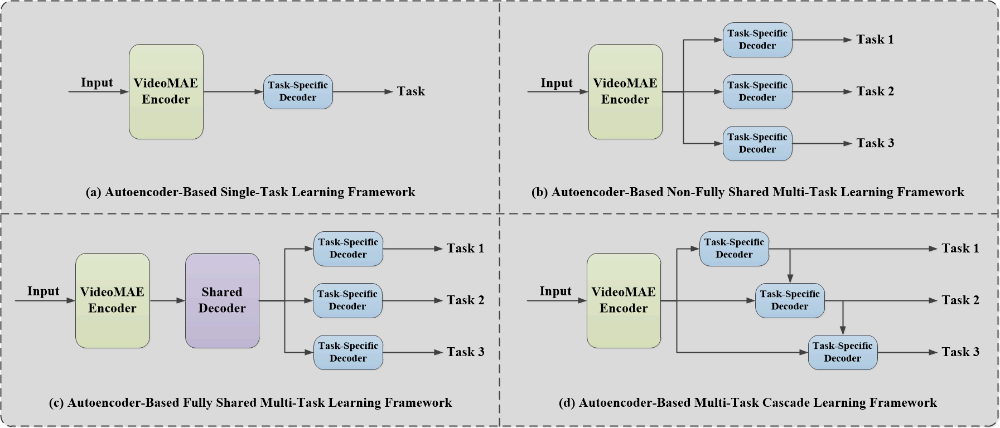
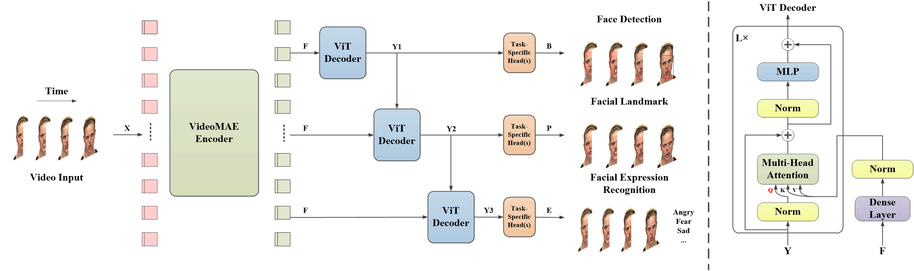

# MTCAE-DFER: Multi-Task Cascaded Autoencoder for Dynamic Facial Expression Recognition

[](https://paperswithcode.com/sota/emotion-recognition-on-ravdess?p=multimae-der-multimodal-masked-autoencoder)<br>
[](https://paperswithcode.com/sota/video-emotion-recognition-on-crema-d?p=multimae-der-multimodal-masked-autoencoder)<br>
[](https://paperswithcode.com/sota/multimodal-emotion-recognition-on-iemocap?p=multimae-der-multimodal-masked-autoencoder)<br>

> [](https://hcps.fiu.edu/) [](https://arxiv.org/abs/2412.18988) [](#citation)<br>
> [Peihao Xiang](https://scholar.google.com/citations?user=k--3fM4AAAAJ&hl=zh-CN&oi=ao), [Kaida Wu](https://ieeexplore.ieee.org/author/167739911238744), [Chaohao Lin](https://scholar.google.com/citations?hl=zh-CN&user=V3l7dAEAAAAJ), and [Ou Bai](https://scholar.google.com/citations?hl=zh-CN&user=S0j4DOoAAAAJ)<br>
> HCPS Laboratory, Department of Electrical and Computer Engineering, Florida International University<br>

[](https://colab.research.google.com/github/Peihao-Xiang/MTCAE-DFER/blob/main/MTCAE-DFER_Fine-Tuning%20Code/MTCAE_DFER_Cascaded_ViTDecoder_Example.ipynb)
[](https://huggingface.co/datasets/NoahMartinezXiang/RAVDESS)

Official TensorFlow implementation and ViT Decoder Module codes for MTCAE-DFER: Multi-Task Cascaded Autoencoder for Dynamic Facial Expression Recognitionn.

Note: The .ipynb is just a simple example. In addition, the VideoMAE encoder model should be pre-trained using the MAE-DFER method, but this repository does not provide it.

## Overview

This paper expands the cascaded network branch of the autoencoder-based multi-task learning (MTL) framework for dynamic facial expression recognition, namely Multi-Task Cascaded Autoencoder for Dynamic Facial Expression Recognition (MTCAE-DFER). MTCAE-DFER builds a plug-and-play cascaded decoder module, which is based on the Vision Transformer (ViT) architecture and employs the decoder concept of Transformer to reconstruct the multi-head attention module. The decoder output from the previous task serves as the query (Q), representing local dynamic features, while the Video Masked Autoencoder (VideoMAE) shared encoder output acts as both the key (K) and value (V), representing global dynamic features. This setup facilitates interaction between global and local dynamic features across related tasks. Additionally, this proposal aims to alleviate overfitting of complex large model. We utilize autoencoder-based multi-task cascaded learning approach to explore the impact of dynamic face detection and dynamic face landmark on dynamic facial expression recognition, which enhances the model's generalization ability. After we conduct extensive ablation experiments and comparison with state-of-the-art (SOTA) methods on various public datasets for dynamic facial expression recognition, the robustness of the MTCAE-DFER model and the effectiveness of global-local dynamic feature interaction among related tasks have been proven.

<p align="center">
  <br>
  Illustration of the frameworks.
</p>

Illustration of the differences between the following four frameworks: (a) Autoencoder-Based Single-Task Learning Framework, (b) Autoencoder-Based Non-Fully Shared Multi-Task Learning Framework, (c) Autoencoder-Based Fully Shared Multi-Task Learning Framework and (d) Our Autoencoder-Based Multi-Task Cascaded Learning Framework.

<p align="center">
  <br>
  MTCAE-DFER Model Structure.
</p>

## Implementation details

<p align="center">
   <br>
  The architecture of MultiMAE-DER.
</p>

## Main Results

### RAVDESS


### CREMA-D


### IEMOCAP


## Contact 

If you have any questions, please feel free to reach me out at pxian001@fiu.edu.

## Acknowledgments
This project is built upon [VideoMAE](https://github.com/innat/VideoMAE) and [MAE-DFER](https://github.com/sunlicai/MAE-DFER). Thanks for their great codebase.

In addition, this project is inspired by [MTFormer](https://github.com/xiaogang00/MTFormer) and [MNC](https://github.com/daijifeng001/MNC).

## License

This project is under the Apache License 2.0. See [LICENSE](LICENSE) for details.

## Citation

If you find this repository helpful, please consider citing our work:

```BibTeX
@misc{xiang2024mtcaedfermultitaskcascadedautoencoder,
      title={MTCAE-DFER: Multi-Task Cascaded Autoencoder for Dynamic Facial Expression Recognition}, 
      author={Peihao Xiang and Kaida Wu and Chaohao Lin and Ou Bai},
      year={2024},
      eprint={2412.18988},
      archivePrefix={arXiv},
      primaryClass={cs.CV},
      url={https://arxiv.org/abs/2412.18988}, 
}
```
